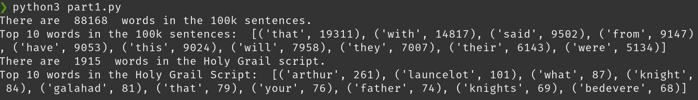

# Mini-project report 
Members: Thomas Longuevergne
Program: Network Security 
Course: 1DV501
Date of submission: 2021-11-02

## Introduction  
This project was a part of the class 1DV501, directly following the assignment 3 by reusing in Part 1 the programs to create a list of words from a file and to count and store these words in a list depending of their number of occurrences.
Part 2 makes us go a bit further while discovering and getting familiar with two Data structures studied in class : The Binary Search Tree and the Hash Table. Finally, in the required exercises, Part 3 makes us redo part 1 while using these data structures.

## Part 1: Count unique words 1

As said in the introduction, most of the work in part one was done in the assignment 3. However, it is needed modify the code to be able to read the right files (here stored in src) and to select the words by length (4 characters or more) to be able to make a list, stored by times the words appear in the file.

Here is the function allowing us to do that:

```python
def count_occurrencies(lst):
    order = sorted(lst)
    occurrences = {}

    for i in range(len(order)):
        if len(order[i]) >= 4:
            if order[i] in occurrences:
                occurrences[order[i]] += 1
            else:
                occurrences[order[i]] = 1
    reverse = sorted(occurrences.items(),
                     key=lambda x: x[1], reverse=True)[:10]
    return reverse
```
- First, the list of words is called and stored by alphabetical order. An empty dictionary is created.

- Then we iterate with a for loop through the list, counting the length of the word. If it is longer than 4 characters, it is going through next if statement.

- From there, two possibilities :
    1. It's the first time the word is met -> it is stored in the dictionary, the word as a key and the number of times it went through the loop (1 for now) as a value.

    2. The word is already stored in the dictionary. In this case, its value in the dictionary is increased by 1.


> As we can see there are 88231 words counted in the 100k sentences file, 1915 in the Holy Grail script

## Part 2: Implementing data structures

Here comes the trickier part of the project. It is actually part 2 which required most of the time in the project. These  were two data structures I were not familiar with, in despite of them being covered in the 1DV501 course. I had to search external resources, which I found in [this playlist](https://www.youtube.com/playlist?list=PLeo1K3hjS3uu_n_a__MI_KktGTLYopZ12 "Data structure from codebasics") and in [this one](https://www.youtube.com/playlist?list=PLprfEn_dJT08ResHBUWgoS9qXnk29iHoM).

> <strong>Disclaimer</strong>:  
> As you can see there is one of the resources using python and explaining how to code. I used it as an help to understand how BST and Hash Tables work, not as a fully given solution. And of course, as Dhaval's videos were a main source of my knowledge of these data structures, my code is sometimes similar to his.

### The Hash based set

*<strong>Note</strong>:  
By testing my code, the order of the words in the set is different from the example. This difference is caused by the difference in the hashing algorithms. Since it is the first time I am manipulating hash tables, my hashing algorithm is simply adding the ASCII code of each character in the word and divide it by my number of buckets.* 

#### The add function:

```python
def add(self, word):
	i = self.get_hash(word)    # Hash the word to get an int in [0, no. buckets]
	bucket = self.buckets[i]   # Go to the bucket no. hash
	check = False
	if bucket != []:
	    for entry in bucket:
	        if entry[0] == word:
	            entry[1] += 1
	            check = False
	            break
	        else:
	            check = True
	    if check is True:
	        bucket.append([word, 1])
	        self.size += 1
	else:
	    bucket.append([word, 1])
	    self.size += 1
```

First, the word goes through the hashing function described a bit higher.
Then I check the bucket associated with this integer:

- if it is empty, I add a list made of the word as its first value and a counter (I could use a tuple but since a tuple is immutable, I chose a list for it to be a little bit easier) as its second and increase the number of data by 1.
- if there are data in the bucket, but not the word I want to add, I add the same list as previously, increasing the number of data by 1.
- if the word I want to add is in the bucket, I just increase its counter by 1, without increasing the number of data.

> In the beginning, I used a method called linear probing to store only one data in a bucket, checking for the next empty bucket. But to do that I needed to create a loop in a loop and as you can imagine, the Order was exponential. Don't do that. A more efficient method in our case is the chaining, storing our pair word-counter in a tuple or a list. Since there is a rehash function, this method will always be efficient.

#### Rehashing

For each value added, I check if I have as much data as the number of buckets.  
If it is the case, a rehash is automatically called.
 
A rehash is a very simple way to minimize the size of our buckets.
It makes a copy of our hash table, to empty it and double its size (it is possible to use prime numbers as the maximum size of the table, to minimize collisions). Then, it will add every data stored in the table as previously, except the size of the table is now doubled.

### The BST based map

I personally found the Binary Search Tree  challenging to understand and conceptualize. The idea behind a binary search tree is to organize the data by value, comparing it with the latest input.  
Each value is called a Node with:

- a key, the data we compare to organize our tree, 
- a value, which is optional,
- two children:
	1. the left one which is the next inferior value in the list
	2. the right one which is the next superior value in the list

#### The put function

The put function is the function allowing to input a word in the right place in the tree. Here, we are storing by alphabetical order which is automatically done by the operators <, >, ==. This function is done by comparison and recursion through the tree.

```python
def put(self, key, value):
        if not self.key:
            self.key = key
            self.value = value
        else:
            if self.key == key:
                self.value = value
                self.occurrences += 1
            elif key < self.key:
                if self.left:
                    self.left.put(key, value)
                else:
                    self.left = Node(key, value)
            else:
                if self.right:
                    self.right.put(key, value)
                else:
                    self.right = Node(key, value)
```

Here we are putting a function with the key and value.
The first thing the function checks is if the Node already exists. It is this statement which create the Node in the tree.  
If there is a Node, the function compares with the Node. It can be equal, smaller or bigger than the Node.
If the key of our input is smaller, it is sent to the left, if bigger, it's sent to the right. If it's equal, an occurrences counter is incremented by 1.

#### The max_depth function

This function returns the maximum number of Nodes following each other. In the way it works, it is similar to the mathematical induction.

```python
def max_depth(self):
        if self.left:
            depth_left = self.left.max_depth()
        elif not self.left:
            depth_left = 0

        if self.right:
            depth_right = self.right.max_depth()
        elif not self.right:
            depth_right = 0
        depth_max = 1 + max(depth_right, depth_left)
        return depth_max
```

This function is also working by recursion.  
The idea here is to, every time the recursion is called, increase the counter "depth\_max" by 1 and in the end to call back the maximum value for depth\_max. Since every Node is returning the 
If the Node is not connected to any child node, it ends the recursion by returning 0. Every child is returning its value to its parent, which is comparing its children value and returning the biggest value +1 to its parent, until it reaches back the root Node.

#### Traversing the Tree

There are three common ways to output the values stored in the tree:

- In-order traversal, displaying the Nodes in the way they were inputted (root to leaves)
- Pre-order traversal, displaying the Nodes in the ascending order
- Post-order traversal, displaying the data from leaves to root.

In this project, the chosen one is the pre-order traversal. Therefore, my output is the same that the example.

*Note:  
No matter which order is chosen, it is commonly agreed to always display the data from left to right.*

## Part 3: Count unique words 2

As the objective of part 2 was to discover the Data structures, this part is focused on the different uses for them by repeating the first part. Some parts are of course similar to the Part 1 as the same files need to be called.

In the beginning I thought to use a counter in my Node class to be able to display it, but I noticed I didn't have any function to call this counter. While writing this ReadMe file, in the hash section, I noticed I could use my value as a counter the same way I have been using it in the add function.  
It looks like this:

```python
if len(word) >= 4:
	value = holy_map.get(word)
	if value is None:
	    holy_map.put(word, 1)
	else:
	    value += 1
	    holy_map.put(word, value)
```

After checking if the length of the word is at least 4, the function checks if the function exists in the tree, and if it does it increments the counter by 1.  
Then it converts the function as a list, sorts it by value, and reverse to finally take the last 10 values, like seen in the following snippet:

```python
holy_top = sorted(holy_map.as_list(), key=lambda x: x[1], reverse=True)[:10]
```


> By comparing the screenshot with the output of part 1, it is possible to see that the output is the same for both files.
For the 100K sentences, the max bucket is 325 and the max depth is 42. For the Holy Grail script, the max bucket is 17 and the max depth is 23.

## Project conclusions and lessons learned

### Technical issues

The major technical issue was to conceptualize both Data Structures. Finding accessible and beginner-friendly resources was time consuming.

Also, the lack of my understanding of some python implementations has been a trouble. For example, for BstMap.py, I coded a comparing function which were comparing the ASCII of 2 words and returned if it was needed to go left or right in the tree.  
At this moment I didn't know the operators were able to compare letters. There were many situations like this which made me lose time.

But the project taught me to test things I assumed not possible, even if the outcome is predictable and to read the manual. It also taught me how to search for resources in an efficient way and helped me to classify  my sources (of course [the python documentation](docs.python.org "Python Doc") comes first, but the website of the [W3School](w3school.com "W3School") is easier to read).

### Project issues

At first, we were a group of 4. As we met the first time, we decided to split the group in two and work by pair on the Part 2 since Part 1 was already partially done and Part 3 depended on Part 2. As we went forward, each member progressed at different speed and prioritized different aspects of their studies, which ended in me being more implicated, around 6 to 8 hours a week including the research, and finishing the Parts 1 to 3 almost by myself.  
For the next group project, I think some kind  of contract that each member should sign, enunciating the conditions of the project without being strict, would be benefic and give and extra motivation to the members to work daily on the project.  
As for me, maybe trying to adapt a bit more to the speed of the other members instead of trying to drag the project would be a goal and would help me to collaborate a bit more with others.